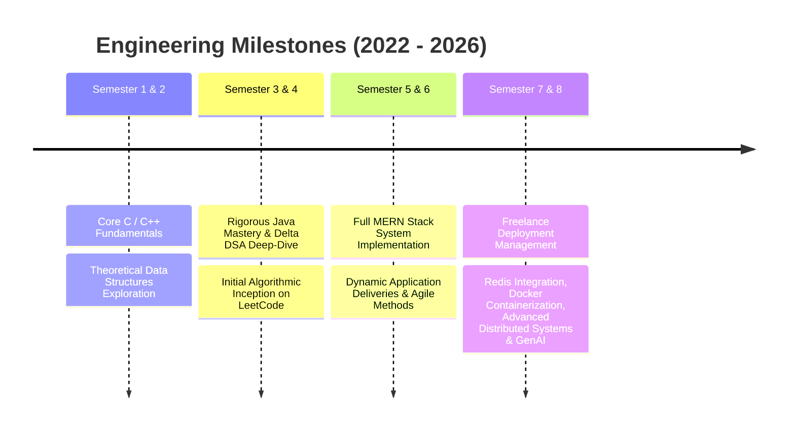

<!-- ========================================================= -->
<!--                     HERO SECTION                          -->
<!-- ========================================================= -->

<div align="center">
  <h1>🚀 Nitin Valmik Gayke</h1>
  
  
  
  <p>
    <strong>Software Engineer & Full-Stack Developer</strong> specialized in building scalable backend architectures, real-time distributed systems, and production-ready GenAI applications.
  </p>
</div>

<!-- ========================================================= -->
<!--                   SOCIAL BADGES                           -->
<!-- ========================================================= -->

<div align="center">
  
[](https://github.com/nitingayke)
[](https://linkedin.com/in/nitin-gayke92)
[](https://leetcode.com/Nitin_Gayke/)
[](https://nitin-portfolio-6v8f.vercel.app/)
[](mailto:gaykenitin975@gmail.com)
[](https://codeforces.com/profile/gaykenitin9209)

<br/>


</div>

---

<!-- ========================================================= -->
<!--                         ABOUT ME                          -->
<!-- ========================================================= -->

## 🚀 About Me

<div align="center">
  
</div>

🎓 **B.Tech in Computer Science & Engineering** (GPA: **8.57**) - Sandip University, Nashik  
💻 Passionate **Full Stack Developer** crafting high-throughput, low-latency web & mobile platforms  
🏆 **LeetCode Knight** with an elite competitive programming track record (**1,681+ Problems Solved**)  
⚡ Expert with the **MERN Stack**, **Spring Boot**, **Microservices**, and high-concurrency systems  
🤖 Deeply diving into **Generative AI**, **LangChain**, LLM pipelines, and semantic vector architectures  
🌱 Building robust infrastructure using **Docker**, **Redis Caching**, and **Kafka Event Brokerage**  
💼 Experienced **Freelance Developer** managing end-to-end production cycles for global clients  

<br clear="right"/>

---

<!-- ========================================================= -->
<!--                    LIVE STATS DASHBOARD                   -->
<!-- ========================================================= -->

## 📈 Live Metrics & Competitive Programming

<div align="center">
  <table>
    <tr>
      <td width="50%" align="center">
        <h3>🔥 GitHub Contribution Streak</h3>
        
      </td>
      <td width="50%" align="center">
        <h3>💻 LeetCode Live Analytics</h3>
        
      </td>
    </tr>
    <tr>
      <td width="50%">
        
      </td>
      <td width="50%">
        
      </td>
    </tr>
  </table>
</div>

### 📊 Algorithmic Problem Breakdown

| Difficulty | Solved | Total | Progress |
|------------|--------|-------|----------|
| 🟢 **Easy** | 372 | 951 | ██████████░░ 39% |
| 🟡 **Medium** | 980 | 2077 | ██████████░░ 47% |
| 🔴 **Hard** | 329 | 949 | ████████░░░░ 34% |
| **Total** | **1,681** | **3,977** | **42%** |


```

👑 Badge Status: Knight (Top 3.89% Globally) | 🏁 Contests: 90+ | 📊 Peak Rating: 1,952 | 🔥 366+ Days Streak

```

---

<!-- ========================================================= -->
<!--                      TECH STACK                           -->
<!-- ========================================================= -->

## 🛠️ Technical Toolkit

### 💻 **Languages**
<div align="center">
  <table>
    <tr>
      <td></td>
      <td><strong>Java</strong> - Advanced OOP, Spring Boot, Microservices</td>
      <td></td>
      <td><strong>JavaScript / TS</strong> - Modern ES6+, Node.js runtime</td>
      <td></td>
      <td><strong>Python</strong> - Generative AI pipelines, FastAPI frameworks</td>
    </tr>
    <tr>
      <td></td>
      <td><strong>C++</strong> - High-Performance Competitive Programming</td>
      <td></td>
      <td><strong>HTML5 & CSS3</strong> - Semantics, Responsive UI Frameworks</td>
      <td></td>
      <td><strong>SQL</strong> - Relational schemas, query optimization</td>
    </tr>
  </table>
</div>

### 🎨 **Frontend Frameworks**
<div align="center">
  <table>
    <tr>
      <td></td>
      <td><strong>React.js</strong> - Virtual DOM architecture, State Engines</td>
      <td></td>
      <td><strong>Next.js</strong> - SSR, Static Site Generation, App Router</td>
      <td></td>
      <td><strong>Tailwind CSS</strong> - Atomic, layout systems design</td>
    </tr>
  </table>
</div>

### ⚙️ **Backend, Databases & Caching**
<div align="center">
  <table>
    <tr>
      <td></td>
      <td><strong>Spring Boot</strong> - Cloud Config, Enterprise Layering</td>
      <td></td>
      <td><strong>Node.js & Express</strong> - Asynchronous, RESTful API endpoints</td>
      <td></td>
      <td><strong>FastAPI</strong> - Highly performant ASGI endpoints</td>
    </tr>
    <tr>
      <td></td>
      <td><strong>MongoDB</strong> - Distributed BSON Document clusters</td>
      <td></td>
      <td><strong>Redis</strong> - High-throughput Caching & Pub/Sub messaging</td>
      <td></td>
      <td><strong>Kafka</strong> - Event stream processing architectures</td>
    </tr>
  </table>
</div>

### 🤖 **Real-Time Communications & AI Systems**
<div align="center">
  <table>
    <tr>
      <td></td>
      <td><strong>WebRTC</strong> - P2P Mesh topologies, audio/video pipelines</td>
      <td>🌐</td>
      <td><strong>Socket.IO</strong> - Low-latency bidirectional event handling</td>
    </tr>
    <tr>
      <td>🧠</td>
      <td><strong>LangChain</strong> - Multi-agent LLM chain systems</td>
      <td>⚙️</td>
      <td><strong>Generative AI & RAG</strong> - Vector Databases, Vector search</td>
    </tr>
  </table>
</div>

### ☁️ **DevOps & Infrastructure**
<div align="center">
  <table>
    <tr>
      <td></td>
      <td><strong>Docker</strong> - Isolated software image micro-containers</td>
      <td></td>
      <td><strong>Git & Versioning</strong> - Advanced Git rebasing, branch controls</td>
      <td></td>
      <td><strong>Postman</strong> - API validation, automated testing suites</td>
    </tr>
  </table>
</div>

---

<!-- ========================================================= -->
<!--                   SKILL PROFICIENCY                       -->
<!-- ========================================================= -->

## 🎯 Architectural Expertise & Skill Proficiency

<div align="center">
  <table>
    <tr>
      <td width="50%">
        <h4>Core Systems Engineering</h4>
        <table>
          <tr><td><strong>Data Structures & Algorithms</strong></td><td>████████████████████░ 95%</td></tr>
          <tr><td><strong>Java & Spring Boot</strong></td><td>██████████████████░░░ 85%</td></tr>
          <tr><td><strong>Node.js / React (MERN Stack)</strong></td><td>████████████████████░ 92%</td></tr>
          <tr><td><strong>System Design (HLD/LLD)</strong></td><td>███████████████░░░░░░ 75%</td></tr>
        </table>
      </td>
      <td width="50%">
        <h4>Advanced & Infrastructure Ecosystem</h4>
        <table>
          <tr><td><strong>Real-Time Systems (Sockets, WebRTC)</strong></td><td>██████████████████░░░ 88%</td></tr>
          <tr><td><strong>AI Agents & LangChain Orchestration</strong></td><td>████████████████░░░░░ 80%</td></tr>
          <tr><td><strong>Caching & Streaming (Redis, Kafka)</strong></td><td>███████████████░░░░░░ 75%</td></tr>
          <tr><td><strong>DevOps (Docker & CI/CD)</strong></td><td>██████████████░░░░░░░ 70%</td></tr>
        </table>
      </td>
    </tr>
  </table>
</div>

---

<!-- ========================================================= -->
<!--                   CS FUNDAMENTALS                         -->
<!-- ========================================================= -->

## 📚 Computer Science Fundamentals

✅ **Data Structures & Algorithms** - Core design patterns, analytical analysis, 1,681 solutions  
✅ **Object-Oriented Design** - Java ecosystem framework architectures, SOLID principles  
✅ **Operating Systems** - Concurrency controls, process schedules, memory caching schemes  
✅ **Computer Networks** - TCP/IP stack configurations, HTTP protocol definitions, WebRTC architecture  
✅ **Database Management Systems** - Document indexing schemas, relational mapping normalization  
✅ **Distributed Architecture** - Scalable microservice design topologies, caching tiers, message brokers  

---

<!-- ========================================================= -->
<!--                        EXPERIENCE                         -->
<!-- ========================================================= -->

## 💼 Professional Experience

### 🛠️ **Freelance Full-Stack Developer**
**Production-Grade Web & Mobile Software Architecture**  
*Mar 2025 - Present*

<div align="center">
  <table>
    <tr>
      <td width="100%" align="left">
        <p>Designing, managing, and building enterprise web services, real-time data pipelines, and intelligent AI layers directly for commercial clients.</p>
        <h4>✨ Key Achievements</h4>
        <ul>
          <li>🏗️ <strong>Scalable Systems:</strong> Built robust RESTful architectures leveraging Spring Boot and Node.js backend layers with multi-level database constraints.</li>
          <li>🔐 <strong>Security Auditing:</strong> Implemented cryptographic OAuth2 flow states, complex JWT token lifetimes, and automated secure OTP transaction verifications.</li>
          <li>🤖 <strong>AI Orchestration:</strong> Engineered proprietary data structures integrating LLM vector indices with production transactional databases.</li>
          <li>⚡ <strong>DevOps Automation:</strong> Architected immutable system deployments utilizing Docker multi-stage image configs onto Vercel and Render infrastructure.</li>
        </ul>
        <h4>🛠 Tech Stack</h4>
        <p>Spring Boot • Node.js • Express.js • MongoDB • Redis • Generative AI • OAuth • JWT • Docker • Vercel • Render</p>
      </td>
    </tr>
  </table>
</div>

---

<!-- ========================================================= -->
<!--                    FEATURED PROJECTS                      -->
<!-- ========================================================= -->

## 🌟 Featured Projects

### 🤖 **Synthora - AI-Powered Q&A Platform**
**Intelligent Collaboration Engine** — *React.js | Spring Boot | FastAPI | LangChain | Vector Search | Socket.IO*

<div align="center">
  <table>
    <tr>
      <td align="left" width="60%">
        <p>An intelligent, highly distributed Q&A engine blending autonomous Generative AI workflows with low-latency human real-time workspace systems.</p>
        <h4>✨ System Capabilities</h4>
        <ul>
          <li>🧠 <strong>AI Reasoning Agents:</strong> Developed complex prompt engineering and LangChain pipeline networks utilizing Groq and OpenAI backends.</li>
          <li>📚 <strong>Semantic RAG Pipeline:</strong> Configured vector database embeddings for dense information retrieval and cognitive web search context mappings.</li>
          <li>💬 <strong>Real-time Synchronizer:</strong> Built real-time canvas layers with Socket.IO event brokers for near-zero messaging overhead.</li>
          <li>🏗️ <strong>Microservice Mesh:</strong> Interlinked multi-tier Spring Boot, Node.js, and FastAPI architectures via secure private service meshes.</li>
        </ul>
        <p>
          <a href="https://github.com/nitingayke/synthia">
            
          </a>
        </p>
      </td>
      <td align="center" width="40%">
        
        <br><br>
        
        <br>
        
      </td>
    </tr>
  </table>
</div>

---

### 💬 **ChatMeetUp - Multimedia Telephony Platform**
**Real-Time Data Streams & Media Pipelines** — *React.js | Node.js | WebRTC Mesh | Socket.IO Cluster | MongoDB*

<div align="center">
  <table>
    <tr>
      <td align="center" width="40%">
        
        <br><br>
        
        <br>
        
      </td>
      <td align="left" width="60%">
        <p>A high-concurrency communications ecosystem offering instantly scalable one-to-one text networking and high-fidelity video conferencing paths.</p>
        <h4>✨ System Capabilities</h4>
        <ul>
          <li>📹 <strong>P2P Video Topology:</strong> Formed complex WebRTC connection handshakes, ICE candidate discoveries, and SDP negotiation streams.</li>
          <li>⚡ <strong>State Synchronization:</strong> Programmed multi-room group messaging logic utilizing transactional MongoDB indexes and Redis data primitives.</li>
          <li>🔐 <strong>Access Gateway:</strong> Standardized end-to-end token validation with secure JWT route filters.</li>
        </ul>
        <p>
          <a href="https://github.com/nitingayke/chatmeetup">
            
          </a>
        </p>
      </td>
    </tr>
  </table>
</div>

---

### 🛒 **Real-Time E-Commerce Engine**
**High-Concurrency Order Processing Ecosystem** — *React.js | Node.js | Express | Redis Caching | MongoDB*

<div align="center">
  <table>
    <tr>
      <td align="left" width="60%">
        <p>A production-ready e-commerce machine engineered around real-time state changes, deep role-based dashboard access, and highly resilient caching patterns.</p>
        <h4>✨ System Capabilities</h4>
        <ul>
          <li>⚡ <strong>Cache-Aside Framework:</strong> Placed Redis caches over hot relational lookup keys, achieving massive drops in primary database engine exhaustion.</li>
          <li>📦 <strong>Inventory Mutex Control:</strong> Configured race-condition guardrails across product inventories utilizing robust transactional state controls.</li>
          <li>💳 <strong>Secure Gateway Interfacing:</strong> Managed strict multi-factor client verification processes via automated OTP generation nodes.</li>
        </ul>
        <p>
          <a href="https://github.com/nitingayke/ecommerce">
            
          </a>
        </p>
      </td>
      <td align="center" width="40%">
        
        <br><br>
        
        <br>
        
      </td>
    </tr>
  </table>
</div>

---

<!-- ========================================================= -->
<!--                ROADMAP & ROAD TO PRODUCTION               -->
<!-- ========================================================= -->

## 🗺️ Academic & Practical Engineering Journey



### 🔬 Active Specialized Studies

* **System Design:** Partitioning, Replication, Consistent Hashing, Sharding
* **Message Handlers:** Event Driven Streaming with Apache Kafka
* **Spring Layering:** Microservice Discovery Hubs & Spring Security Shielding

---

## 🌱 Current Direction & Goals for 2026

<div align="center">

| 🎯 Current Focus | 🚀 Status |
|------------------|----------|
| 🏗️ Mastering System Design (HLD + LLD) | 🔄 In Progress |
| ☕ Spring Boot & Microservices | 🔄 Learning Daily |
| ⚡ Redis, Kafka & Distributed Systems | 🔄 Building Projects |
| 🤖 Generative AI & Multi-Agent Systems | 🔄 Active Development |
| 📱 React Native | 🔄 Exploring |
| 🧩 Competitive Programming | ✅ 1,681+ Problems Solved |
| 💼 Preparing for SDE-1 Interviews | 🎯 2026 Goal |

</div>

### Current Learning

- ⚡ Scalable Distributed Systems
- ⚡ Apache Kafka
- ⚡ Redis Caching
- ⚡ Docker & CI/CD
- ⚡ System Design (HLD + LLD)
- ⚡ Spring Security & OAuth2
- ⚡ AI Agents with LangChain & LangGraph

### 2026 Targets

- 🎯 Software Development Engineer (SDE-1)
- 🎯 Build Production-Scale Backend Systems
- 🎯 2000+ LeetCode Problems
- 🎯 LeetCode Rating 2100+
- 🎯 Open Source Contributions
- 🎯 Build Enterprise-Level AI Applications

---

## 🎓 Education

<div align="center">

| Degree | Institute | Duration | CGPA |
|---------|-----------|----------|------|
| 🎓 B.Tech Computer Science & Engineering | Sandip University, Nashik | Aug 2022 – Jul 2026 | **8.57 / 10** |

</div>

### Relevant Coursework

- Data Structures & Algorithms
- Object-Oriented Programming
- Database Management Systems
- Operating Systems
- Computer Networks
- Software Engineering
- Distributed Systems
- Artificial Intelligence

---

## 📊 Developer Footprint

<div align="center">


<br><br>


<br><br>


</div>

---

## 🤝 Establish Contact

| Channel | Destination Link |
| --- | --- |
| 🌐 **Digital Portfolio** | [nitin-portfolio-6v8f.vercel.app](https://nitin-portfolio-6v8f.vercel.app/) |
| 💼 **LinkedIn Profile** | [linkedin.com/in/nitin-gayke92](https://linkedin.com/in/nitin-gayke92) |
| 💻 **GitHub Handle** | [github.com/nitingayke](https://github.com/nitingayke) |
| 🧠 **LeetCode Room** | [leetcode.com/Nitin_Gayke](https://leetcode.com/Nitin_Gayke/) |
| 📧 **Direct Email** | [gaykenitin975@gmail.com](https://www.google.com/search?q=mailto%3Agaykenitin975%40gmail.com) |
| 🏅 **Codeforces Terminal** | [codeforces.com/profile/gaykenitin9209](https://codeforces.com/profile/gaykenitin9209) |

---

### ⭐ Thank you for visiting my terminal hub!

**If you find my structural architecture compelling, consider leaving a ⭐ on my source codes!**
