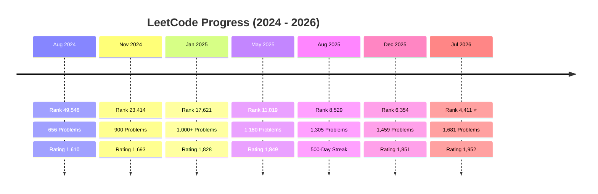

# 🚀 Nitin Valmik Gayke

<div align="center">

[](https://git.io/typing-svg)

[](https://leetcode.com/Nitin_Gayke/)
[](https://linkedin.com/in/nitin-gayke92)
[](https://github.com/nitingayke)
[](https://nitin-portfolio-6v8f.vercel.app/)
[](mailto:gaykenitin975@gmail.com)
[](https://codeforces.com/profile/gaykenitin9209)


</div>

---

## 👨‍💻 About Me

> **Software Engineer | Full-Stack Developer | DSA Enthusiast**

I'm a **2026 Computer Science graduate** passionate about building scalable software and solving challenging engineering problems. Over the past few years, I've consistently worked on strengthening my software engineering fundamentals through **daily DSA practice** and **real-world projects**.

### 🎯 Quick Highlights

<table>
<tr>
<td>

🏆 **1,681** DSA Problems Solved  
👑 **Knight** on LeetCode (Top 3.89%)  
📊 **1,952** Contest Rating  
🔥 **366-day** Current Streak  

</td>
<td>

🏁 **90+** Coding Contests  
🎖️ **39** LeetCode Badges  
🚀 **20+** Full-Stack Projects  
💼 **Active** Freelance Developer  

</td>
</tr>
</table>

---

## 📈 LeetCode & Competitive Programming

<div align="center">


</div>

### 📊 Problem Breakdown

| Difficulty | Solved | Total | Progress |
|------------|--------|-------|----------|
| 🟢 **Easy** | 372 | 951 | ██████████░░ 39% |
| 🟡 **Medium** | 980 | 2077 | ██████████░░ 47% |
| 🔴 **Hard** | 329 | 949 | ████████░░░░ 34% |
| **Total** | **1,681** | **3,977** | **42%** |

### 🏅 Badges Earned

```
👑 Knight        🏆 500 Days       🎯 365 Days
📅 200 Days      ⭐ 100 Days       🔥 50 Days
🏁 90+ Contests  🎖️ 39 Total Badges
```

---

## 🗺️ My Software Engineering Journey

### 🎓 **Semester 1** (Aug 2022 - Dec 2022)
> 🌱 *Laid the Foundation*

- Started B.Tech in Computer Science at Sandip University
- Focused on curriculum and explored technologies
- Learned **C programming** fundamentals
- Built strong base in programming concepts

---

### 🎓 **Semester 2** (Jan 2023 - May 2023)
> 📚 *First Steps into DSA*

- Started **C++ programming**
- Explored Data Structures & Algorithms concepts
- Watched online DSA lectures (didn't solve problems yet)
- Strengthened programming fundamentals

---

### 🎓 **Semester 3** (Aug 2023 - Dec 2023)
> 🔥 *Accelerated Learning*

- Enrolled in **Apna College** courses:
  - **Alpha Plus**: Complete DSA Batch (Java + DSA + Advanced DSA)
  - **Sigma Batch**: Complete DSA + Web Development (MERN)
- Learned **Java** in-depth (university curriculum aligned)
- Started Web Development fundamentals
- Built first HTML/CSS projects
- Gained strong foundation in Data Structures

---

### 🎓 **Semester 4** (Jan 2024 - May 2024)
> 💻 *Started Building*

- Began solving problems on **LeetCode**
- Started Web Development journey (HTML, CSS, JavaScript)
- Built small projects to apply learning
- Strengthened problem-solving skills

---

### 🎓 **Semester 5** (Aug 2024 - Nov 2024)
> ⚡ *MERN Stack Mastery*

- Started learning **MERN Stack** (MongoDB, Express, React, Node.js)
- Built multiple small projects
- Continued DSA practice consistently

---

### 🎓 **Semester 6** (Jan 2025 - May 2025)
> 🚀 *Full-Stack Development*

- Built full-stack projects independently
- Contributed to team projects
- Maintained DSA consistency

---

### 🎓 **Semester 7** (Aug 2025 - Dec 2025)
> 💼 *Freelancing & Advanced Technologies*

- Started **Freelance Full-Stack Development** (Mar 2025 - Present)
- Learned **GenAI** and integrated with projects
- Explored **Docker** for containerization
- Learned **System Design** principles
- Understood **LLM basics** and **High-Level Design**

---

### 🎓 **Semester 8** (Jan 2026 - Jul 2026)
> 🔬 *Production-Ready Engineering*

- Built **GenAI + MERN** integrated applications
- Integrated external APIs in projects
- Learned **Redis** for caching and real-time systems
- Deepened **System Design** knowledge
- Submitted Final Year Project
- Learning **Spring Boot Advanced**, **Microservices**

---

### 📊 LeetCode Progress Timeline



---

## 🛠️ Technical Skills

### 💻 Languages


### 🚀 Backend & APIs


### 🎨 Frontend


### 🗄️ Databases


### 🔗 Real-Time & AI


### ⚙️ DevOps & Tools


---

## 📚 Computer Science Fundamentals

✅ **Data Structures & Algorithms** - 1,681 problems solved  
✅ **Object-Oriented Design** - Java, OOP principles  
✅ **Operating Systems** - Process management, Memory management  
✅ **Computer Networks** - TCP/IP, HTTP, WebRTC  
✅ **Database Management Systems** - MongoDB, MySQL, Redis  
✅ **System Design** - Scalable architecture, Microservices  
✅ **Low-Level Design** - Design patterns, SOLID principles  

---

## 🚀 Featured Projects

### 🤖 Synthora - AI-Powered Q&A Platform

> AI-powered Q&A platform with real-time collaboration built using React, Spring Boot, FastAPI, and LangChain

**Key Features:**
- 🧠 AI Answer Generation using LangChain
- 🔄 Human + AI Collaboration
- 🌐 Web Search Integration
- 📊 Vector Database for Semantic Search
- 💬 Real-time Communication with Socket.IO
- 🔐 JWT Authentication
- 🏗️ Microservice Architecture

**Tech Stack:**


[](https://github.com/nitingayke/synthia)

---

### 💬 ChatMeetUp - Real-Time Communication Platform

> Scalable one-to-one and group messaging platform with video conferencing support

**Key Features:**
- 💬 One-to-One & Group Messaging
- 📹 Video Conferencing with WebRTC
- 📎 Media Sharing
- 🔐 JWT Authentication
- 📱 Responsive React UI
- ⚡ Low-latency Socket.IO Communication

**Tech Stack:**


[](https://github.com/nitingayke/chatmeetup)

---

### 🛒 Real-Time E-Commerce Platform

> Production-grade e-commerce platform with role-based access, secure payments, and live order tracking

**Key Features:**
- 🛍️ Role-Based Access Control
- 💳 Secure Payment Integration
- 📦 Inventory Management
- 🚚 Live Order Tracking
- 🔐 OAuth + JWT Authentication
- 📱 OTP Verification
- ☁️ Cloud Deployment (Vercel + Render)

**Tech Stack:**


[](https://github.com/nitingayke/ecommerce)

---

## 💼 Experience

### Freelance Full-Stack Developer
📅 **Mar 2025 – Present**

> Building real-world production-grade applications for clients

- Collaborated with development teams to design and build scalable applications
- Built REST APIs using Node.js, Express.js, Spring Boot, and MongoDB
- Implemented OAuth, JWT authentication, and OTP verification
- Deployed applications on Vercel and Render
- Working on GenAI + MERN integrated projects
- Learning System Design & Microservices in production environment

---

## 🎓 Education

### Sandip University, Nashik
📅 **Aug 2022 – Jul 2026**
- Bachelor of Technology (B.Tech) in Computer Science and Engineering
- **GPA:** 8.57/10

---

## 🌱 Currently Learning

- 📌 **System Design & Scalable Architecture**
- 📌 **Redis** for Caching & Real-Time Systems
- 📌 **Docker & Containerization**
- 📌 **Spring Security** & OAuth
- 📌 **Microservices Architecture**
- 📌 **Kafka** for Event-Driven Systems

---

## 📊 GitHub & Activity

<div align="center">

<!-- GitHub Activity Graph -->


<br/><br/>

<!-- Simple Badges (Always Work) -->
<p align="center">
  
  
  
</p>

</div>

---

## ⚡ Quick Facts

☕ **Coffee + Java** = Productivity  
🧩 **1,681 DSA Problems** = Problem-Solving Obsession  
🚀 **Interested in** Distributed Systems & Scalable Architecture  
🤖 **Passionate about** Generative AI & LangChain  
🎯 **Goal:** Build products used by millions  
💡 **Motto:** Continuous Learning & Consistent Practice  

---

## 📫 Connect With Me

<div align="center">

| Platform | Link |
|----------|------|
| 🌐 **Portfolio** | [nitin-portfolio-6v8f.vercel.app](https://nitin-portfolio-6v8f.vercel.app/) |
| 💼 **LinkedIn** | [linkedin.com/in/nitin-gayke92](https://linkedin.com/in/nitin-gayke92) |
| 💻 **GitHub** | [github.com/nitingayke](https://github.com/nitingayke) |
| 🧠 **LeetCode** | [leetcode.com/Nitin_Gayke](https://leetcode.com/Nitin_Gayke/) |
| 📧 **Email** | [gaykenitin975@gmail.com](mailto:gaykenitin975@gmail.com) |
| 🏅 **Codeforces** | [codeforces.com/profile/gaykenitin9209](https://codeforces.com/profile/gaykenitin9209) |

</div>

---

<div align="center">

---

> ⭐ *Thanks for visiting!*  
> *I'm always open to Software Engineering opportunities, open-source collaborations, and discussions about scalable backend systems, distributed architecture, and Generative AI.*  
> *Let's build something impactful together! 🚀*

---

**Profile Views**  


**Follow Me**  
[](https://github.com/nitingayke)

---
</div>
